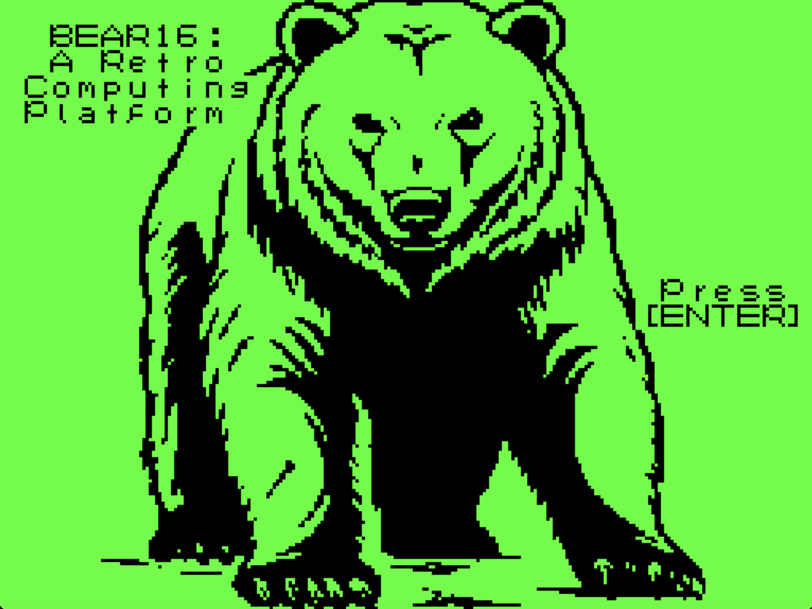
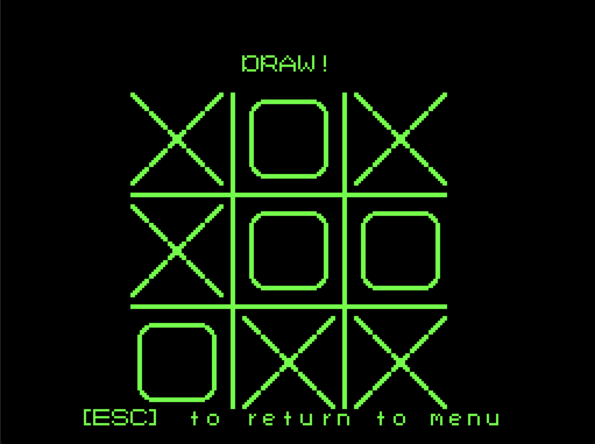

# Bear16 OS

## Preface
- Bear16 is a homebrew 16-bit OS built as a proof of concept for my own instruction set architecture, assembler, and emulator. It is written entirely in assembly and runs in ~20 KB of unified ROM (as of 20250825).
- This OS is intentionally minimal, with basic kernel functionality exposed through a shell and core system utilities. Binary footprint was a major concern during development (given Bear16's hardware 64 KB ROM limit). Function reuse and modularity are greatly favored over inlining.
- Everything has been written in raw assembly, and every image is a manually constructed bitmap. Thankfully, the assembler supports string literals in .data sections.
- The font is my own custom character set that I hand-drew with 1s on blank 8x8 bitmaps (see the [source code here](text_processing.asm) if you're curious)
- All BLITing, math, clock, disk IO, debugging, error handling, memory managing, string, etc. utilities were handwritten too. I did also write a heap allocator with a linked free list. No glibc access at all (just assembly and a dream).
- The "features" of the OS are somewhat limited by the incredibly time-consuming nature of manually writing (and debugging!) assembly.
- Early development was quite tricky before the Bear16 assembler and emulator were mature since I would sometimes be forced to debug not only my assembly, but also every stage of development from assembly through the assembler and into the emulator. These issues are now mostly gone as the Bear16 toolchain has been majorly polished.
- Programming for this OS is incredibly fun, but it is certainly a time sink. Its development is on pause for now, but I will likely revisit it here and there (be it adding new apps or new core utilities).
## Build Instructions
- Visit the [Bear16 tool-chain repo](https://github.com/zachMahan64/bear16) and follow the set-up guide there.
- Run `b16` in your shell to ensure Bear16 is working on your system (it will automatically configure itself on your system if you haven't launched it before). Then, close it down.
- Run `b16 --help` if you need a refresher on Bear16 CLI commands
- Clone the repo:
  - `cd ~/bear16_projects` (this is the default path where bear16 looks for projects)
    - On Windows, it's `cd %USERPROFILE%\bear16_projects`
    - You can clone the repo anywhere on your system, just make sure to replace all references to the path with the one you used for the rest of this guide.
  - `git clone https://github.com/zachMahan64/bear16-os`
- Build and run the OS using the Bear16 Assembler:
  - Using the project-based TUI:
    - Run `b16`
    - Make sure the entry file is `main.asm` and the project name is `bear16` (these should be the default settings, but you can change the config of course).
    - Select one of the "Assemble" options.
    - It should say if your binary was successfully built.
    - Then select "Run."
  - Using the CWD-based CLI:
    - `cd ~/bear16_projects` (`cd %USERPROFILE%\bear16_projects` on Windows)
    - `b16 -a main.asm build/os.bin`
      - or assemble and run all in one go `b16 -ar main.asm build/os.bin`
- You can also directly run a release binary. Just downlaod it and run (after setting up b16):
  - `b16 -r your/download/path/bear16-os.bin`

## The Bear16 Shell

*^ the shell is actually a pretty nice guy*

*^ some more demo*
- All inputs are handled through the emulation layer, and the OS uses the memory-mapped IO locations to access input keypresses.
- You can see the system time, which works through an emulated clock with the correct date and time. It works by being initialized to the host system's clock and then synchronizing 60 times per second to update the memory-mapped clock regions. The OS reads from those regions and can display the time accordingly.
### Full list of commands (as of 20250825):
- "echo" --> echo subsequent text
- "test" --> test if the console is reachable
- "help" --> get a help msg (just tells you to read the repo)
- "clear" --> clear the console's screen
- "open" --> open an app (name given as an argument)
- "hello" --> greet the world
- "hi" --> another greeting
- "hey" --> another greeting
- "login" --> go back to the Bear16 login screen
- "kill" --> halt the OS
- "ferror" --> "force error," designed as a test for critical system error handling
- "reset" --> resets the console back to its initial state
- "notepad" --> launch notepad
- "tictactoe" --> launch tictactoe
- "gravity" --> launch gravity simulator
- More commands can easily be added as the dispatch table is very modular.
- Apps can essentially be dropped in either through the "open" command or pseudo-exported to PATH by placing the name of the app in the command dispatch table.

*^ this is what "ferror" does; it's a good demonstration of what a critical system error message looks like.*

## Bear16 Apps
### Notepad

- As of now, there's no filesystem integration for notepad, so really, it's scratchpad. Once the filesystem is up and running, integration can be added.
- You can use the full ASCII char set (keys like shift, tab, and enter all work as expected)
### Tic-Tac-Toe
- A two-player game with automatic draw and win detection. The code for this is super clean, [feel free to check it out](apps/tictactoe/main.asm).

*^ main menu*

*^ the tips page*

*^ here's what it looks like as we play*

*^ here's what a draw looks like*

*^ here's what a win looks like. The reason it's just three O's in the image is because there's a fun victory animation that plays where the board goes blank and then each winning tile is replaced in order. It's cool; try playing it yourself. Btw, this was not easy to program.*
### Gravity Simulator
- Interactively simulates gravity on a 2d plane with a bouncing elastic ball. Uses the hardware fixed point instructions for calculations. Basis for future games that might need a gravity-based physics core.
## The Bear16 Utilities Library
**The code is decently self-documenting due to its comment-full nature and verbose label and constant names**
- Check it out [here](util/)
- I may add a more rigorous breakdown in this section in the future since this was actually the most technically involved and challenging aspect of developing the OS.
